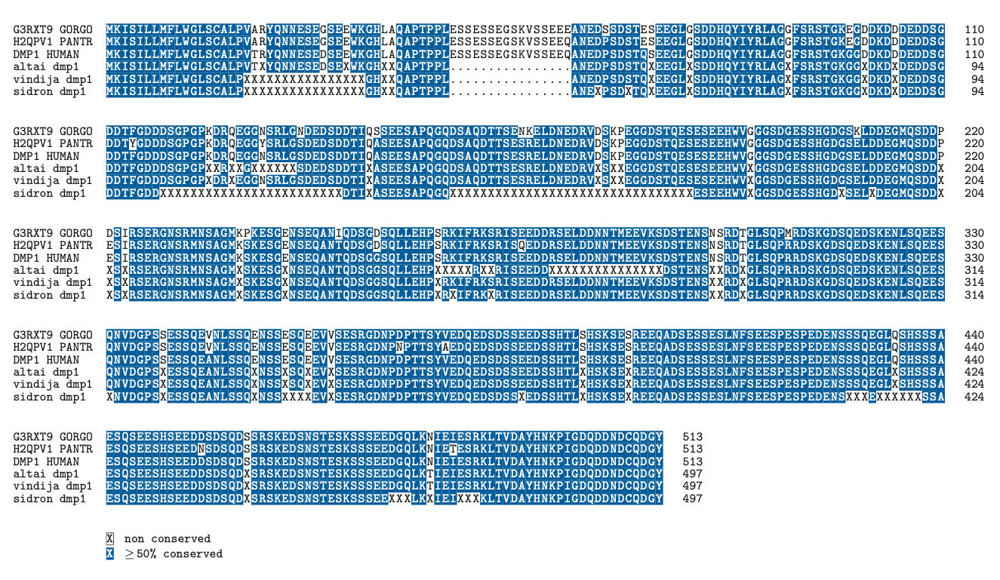

---
title: "Multiple Sequence Alignment"
author: "Cara Yijin Zou"
date: '2021-07-05'
draft: false
tags: ["Bioinformatics", "Multiple Sequence Alignment", "Dental"]
categories: ["Bioinformatics"]
output: html_document
summary: "How to do a multiple sequence alignment using the seqinr and msa package." 
image:
  placement: 1
  caption: "DMP1 Multiple Sequence Alignment"
  focal_point: "Center"
  preview_only: true
---  

```{r setup, include=FALSE}
knitr::opts_chunk$set(echo = TRUE)
```
 
The method and database information was from following journal article: https://www.ncbi.nlm.nih.gov/pmc/articles/PMC5597096/. 

The objective was to discover missense variants that could help explain the differences in dentition between Neanderthals and modern humans. 


## Read in Fastas
```{R}
#read fasta
library(seqinr)

#multiple sequence alignment
library(msa)

#read in fasta using seqinr
altai <- read.fasta("Altai.txt", seqtype="AA",as.string=TRUE)

vindija <- read.fasta("Vindija.txt", seqtype="AA",as.string=TRUE)

sidron <- read.fasta("Sidron.txt", seqtype="AA",as.string=TRUE)

```

## Create function that takes the gene name and outputs a msa
```{R}
msa_maker<- function(gene_name, ensg_num, hcg_fasta_name, combined_fasta_name){
  #Part 1: Create a combined fasta
  #Read in fasta with human, chimp, and gorilla 
  hcg_fasta <- read.fasta(hcg_fasta_name, seqtype="AA",as.string=TRUE,set.attributes = FALSE)
  
  #changed the original sequence names because they were too long and made the final msa look messy 
  hcg_names <- sapply(strsplit(names(hcg_fasta), "|", fixed=TRUE),"[[", 3)
  #write into new combined fasta 
  write.fasta(hcg_fasta, names=hcg_names,file.out = combined_fasta_name, open="w", as.string=TRUE)

  #find the protein in the Neanderthal Data and write it into the combined fasta file 
  #Altai
  #sequence name in file is in the form of ENSGXXXX_ENSTXXXX, grep used to just search with the ENSG info
  altai_index<-grep(ensg_num,attributes(altai)$names)[[1]] 
  altai_filtered<- altai[altai_index]
  #write into new combined fasta
  write.fasta(paste(altai_filtered)[1], paste0("altai_",gene_name),file.out = combined_fasta_name, open="a", as.string=TRUE)
  
  #Vindija
  vindija_index<-grep(ensg_num,attributes(vindija)$names)[[1]]
  vindija_filtered<-vindija[vindija_index]
  write.fasta(paste(vindija_filtered)[1], paste0("vindija_", gene_name),file.out = combined_fasta_name, open="a", as.string=TRUE)
  
  #Sidron
  sidron_index<-grep(ensg_num,attributes(sidron)$names)[[1]]
  sidron_filtered<-sidron[sidron_index]
  write.fasta(paste(sidron_filtered)[1], paste0("sidron_", gene_name),file.out = combined_fasta_name, open="a", as.string=TRUE)
  
  
  
  #Part 2: align the sequences using multiple sequence alignment 
  sequences <- Biostrings::readAAStringSet(combined_fasta_name)
  msa <-msa::msa(
  inputSeqs=sequences,
  method = "ClustalW"
)


return(msa)
}

```

## Function that helps find the missense variant from the msa object 
```{R}
#why is index of each sequence needed? The msa before can arrange the sequences not necessarily in the order inputted
missense_finder<-function(completed_msa,human_index, gorilla_index, chimp_index, altai_index, vindija_index, sidron_index){
  
  #convert the msa to another format so that I can work with it  
  convert_msa <- msaConvert(completed_msa,"seqinr::alignment")
  
  missense_list<-c()

  #go through entire alignment 
  for (i in 1:nchar(convert_msa$seq[1])){
    
    #if the human amino acid doesn't match the altai, add to the stored list 
    if ((substr(convert_msa$seq[human_index],i,i)!=substr(convert_msa$seq[altai_index],i,i))&&(substr(convert_msa$seq[altai_index],i,i)!="X")&&(substr(convert_msa$seq[human_index],i,i)!="-")&&(substr(convert_msa$seq[altai_index],i,i)!="-")){
      
      #stored in the order human, gorilla, chimp, altai, vindija, sidron
      amino_list<-c(i,substr(convert_msa$seq[human_index],i,i),substr(convert_msa$seq[gorilla_index],i,i),substr(convert_msa$seq[chimp_index],i,i),substr(convert_msa$seq[altai_index],i,i),substr(convert_msa$seq[vindija_index],i,i),substr(convert_msa$seq[sidron_index],i,i))
      missense_list=rbind(missense_list, amino_list)
    }
    
    #if human amino acid doesn't match the vindija, add to the stored list 
    else if ((substr(convert_msa$seq[human_index],i,i)!=substr(convert_msa$seq[vindija_index],i,i))&&(substr(convert_msa$seq[vindija_index],i,i)!="X")&&(substr(convert_msa$seq[human_index],i,i)!="-")&&(substr(convert_msa$seq[vindija_index],i,i)!="-")){
      #stored in the order human, gorilla, chimp, altai, vindija, sidron
      amino_list<-c(i,substr(convert_msa$seq[human_index],i,i),substr(convert_msa$seq[gorilla_index],i,i),substr(convert_msa$seq[chimp_index],i,i),substr(convert_msa$seq[altai_index],i,i),substr(convert_msa$seq[vindija_index],i,i),substr(convert_msa$seq[sidron_index],i,i))
      missense_list=rbind(missense_list, amino_list)
      
    }
    
        #if human amino acid doesn't match the sidron, add to the stored list 
    else if ((substr(convert_msa$seq[human_index],i,i)!=substr(convert_msa$seq[sidron_index],i,i))&&(substr(convert_msa$seq[sidron_index],i,i)!="X")&&(substr(convert_msa$seq[human_index],i,i)!="-")&&(substr(convert_msa$seq[sidron_index],i,i)!="-")){
      #stored in the order human, gorilla, chimp, altai, vindija, sidron
      amino_list<-c(i,substr(convert_msa$seq[human_index],i,i),substr(convert_msa$seq[gorilla_index],i,i),substr(convert_msa$seq[chimp_index],i,i),substr(convert_msa$seq[altai_index],i,i),substr(convert_msa$seq[vindija_index],i,i),substr(convert_msa$seq[sidron_index],i,i))
      missense_list=rbind(missense_list, amino_list)
    }
    
  }

  colnames(missense_list)<- c("position","human","gorilla","chimpanzee","altai","vindija", "sidron")
  return(missense_list)
}


```
  

## Find the tooth proteins

#### Dentin matrix acidic phosphoprotein 1 (DMP1) 
##### ENSG00000152592 

```{R}

dmp1_msa<-msa_maker("dmp1", "ENSG00000152592", "uniprot_dmp1.fasta", "combined_dmp1.fasta")

#pretty print the aligned sequence in a pdf file using the following line
#msaPrettyPrint(dmp1_msa,file=paste0("dmp1",".pdf"),askForOverwrite=FALSE, showLogo="none",showConsensus = "none")

missense_finder(dmp1_msa, 3, 1, 2, 4, 5, 6)

```
 
 