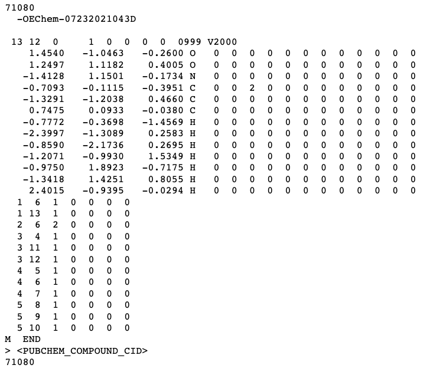

```{r setup, include=FALSE}
knitr::opts_chunk$set(echo = TRUE)
```
*** As I learn more, I will hopefully continue to add to this page for things that confused me or I thought would be helpful to compile together. As a warning, this is just a collection of notes and is not super organized. 

# Basic Programming CheatSheet 

## Unix/Linux (Bash)
Another way of navigating through files and giving commands to the operating system. 

**Absolute** path (begins with "/")

> /home/Downloads/pax9.csv

**Relative** path (does NOT begin with "/")

If you are in /home

> Downloads

> Downloads/pax9.csv

If you are in /home/Downloads

> pax9.csv


| Command                            | Description                                                                    | 
|------------------------------------|--------------------------------------------------------------------------------|
| pwd                                | "print working directory" (absolute)                                           |
| /                                  | root directory                                                                 |
| ls                                 | "listing", gives contents of current directory                                 |
| **ls** /home/Downloads             |  contents of download directory                                                |
| cd                                 | "change directory"                                                             |
| ..                                 | directory above current                                                        |
| .                                  | current directory                                                              |
| ~                                  | home directory                                                                 |
| q                                  | "quit"                                                                         |
| Control + C                        | "cancel"                                                                       |
| top                                | allows you to view the current processes running                               |
|**cp** test.csv test2.csv           | "copy": test.csv is duplicated and named test2.csv (last arg = destination)    | 
|**cp** test.csv other.csv Downloads | "copy": test.csv and other.csv is copied to the Downloads directory            | 
|**mv** test.csv other.csv Downloads | "moves": test.csv and other.csv is moved to the downloads directory            | 
|**mv** test.csv new.csv             | "renames": test.csv is renamed to new.csv   (also works for directory)         |
|**rm** test.csv other.csv           | "removes": deletes other.csv and test.csv  (does not work for directory)       |
|**rmdir**  Downloads                | "removes": directory (must be empty!)                                          |
|**mkdir**  Homework                 | "makes directory" called homework                                              |
|**man** ls                          | "manual" of command ls                                                         |
|**chmod** u+x test.sh               | "change file mode": permissions,  read ( r ), write ( w ) or execute ( x )     |
|Control + D **OR** logout           | to log out of a system                                                         |

Useful Tricks: 

* Hit up and down arrow keys to get previous commands

* Use tab key for autocompletion 

* Spaces for file names can cause problems because they are seen as separate items. To prevent this, put them in quotes or use "\\" before the space

* if a file/destination does not exist, it will create one. If it does exist, it may overwrite 

* there is no **undo**

### Need to kill a process?

1) Get PID (process ID) from top 

2) type: kill PID

3) doesn't work? type: kill -9 PID


### Bash Script
A text file with commands. Anything you put in command line can be in a script and vice versa. Uses the **.sh** extension. 

> #!/bin/bash

First line must always look something like this. "#!" is called a **shebang** and immediately after (no spaces), put the path to the interpreter. If you don't know, type: "which bash" in command line.

> #running program from its path 

> #Bob 07/01/2020

Comments to describe what it does, author, date, etc. 

> name = "Bob"

You can set variables 

> echo Hello $name !

Like print, it will print stuff after it. Refer to variables with a "$" in front.

> pwd 

You can put commands in the script. 

In the actual command line, to **run** the script: 

> ./testscript.sh

AKA, look in the current directory to find the script named testscript.sh and run it.

## R vs Python
While R has a lot of super useful packages, especially for bioinformatics and statistics, I found it **super** annoying to code in base R compared to python. Here are some essential equivalents for R: 

| Python                      | R                                                              |
| ----------------------------|----------------------------------------------------------------|
| len(myList)                 | length(myList) **won't work for strings (see below example)    |
| x in myList                 | x %in% myList                                                  |
| myList.index(item)          | match (item, myList)                                           |
| "string"[:3]                | substr ("string", 1, 3)                                        |
| range(0, 6,2)               | seq(from = 0, 4, by=2)                                         |
| "str"+"ing"                 | paste0("str","ing", "")                                        |
| myList=[1,2]                | myList=c(1,2)                                                  |
| myList.append(3)            | myList=c(myList, 3)                                            |
| myList.extend(myList2)      | myList=c(myList,myList2) **OR** myList=append(myList, myList2) |


**Examples**

1. **python**: len("string") vs **R**: nchar("string")

```{python}
for i in range(len("test")): 
  print (i)
```

```{R}
for (i in 1:nchar("test")){
  print (i)
}
```
2. Matrices

**python**
```{python}
test_matrix=[]
for i in range(3): 
  test_matrix.append([0]*3)
test_matrix[0][1]=2
print(test_matrix)
```

**R**
```{R}
test_matrix<- matrix(0, nrow = 3, ncol = 3)
test_matrix[1,2]=2
print(test_matrix)
```

## Working with data in files or websites 
### Reading files 
Before anthing, make sure you're in the right directory ! 
In python, it looks something like this: 

```{python, eval=F}
import os
os.getcwd()
os.chdir("/Users/Cara/Desktop/")
```

Using open, various functions can be accomplished including: 

* r --> read

* w --> write

* a --> append 

```{python, eval=F}
#open the file for reading 
infile=open("file_name.txt", "r")

#reads one character
char = infile.read(1)

#reads one line until \n
line = infile.readline()
while line!="": 
  # ... 
  line = infile.readline()

#alternatively, use infile.readlines() to get all lines in a list, with \n at the end of each item 
#OR use infile.read() to get all lines from where you are in the file 

#close the file after you're finished! 
infile.close()
```

In R, some quick equivalents include: 

```{R, eval=F}
infile=file("file_name.txt",open="r")
line <-readLines(infile)
close(infile)
```

### Reading websites with Python 

You need to import the urllib request package! 

```{python, eval=F}
from urllib import request

url="http://www.uniprot.org/uniprot/A2Z669.fasta"

#request- opens urls
resp = request.urlopen(url) 

#urlopen is used to open url like open is used for files
#returns html as a string - stored in data variable 
data =  resp.read() 

#don't forget to close your request! 
resp.close()
```

# Genetic Data 

## Reference Sequence Number
When I first started working on genetic data and especially with my [PAX9 project](../../project/PAX9_RF), I was so confused by all of the different values that were associated with the gene: 

Genomic reference: NG_013357.1 (GRCh 37) 

Transcript reference: NM_006194.3

Ensembl gene ID: ENSG00000198807.8

Canonical transcript: ENST00000361487.6


### GRCh 37 
Before going into what all of these sequences are, first of all, what is GRCh37? I kept coming across this when I first trying to find data on my gene. **GRCh37** stands for Genome Reference Consortium Human Build 37 and is generally synonymous with **hg19**. Similarly, **hg38** can also be used to refer to the same genome build as **GRCh38**. 

What is the difference between GRCh37 and GRCh38? GRCh38 was released after GRCh37 and has more updated annotations. Luckily, various tools such as from [NCBI]](https://www.ncbi.nlm.nih.gov/genome/tools/remap) or [Ensembl](https://www.ncbi.nlm.nih.gov/genome/tools/remap) can be used for converting annotations. 


### NCBI Reference Sequence (RefSeq)
The accession number format: 

* NG_: **g**ene/**g**enomic region

* NC_: plus (+) strand on **c**hromosome 

* NT_: constructed genomic contigs (overlapping DNA fragments that are used to assemble the full sequence)

_'NC', 'NG', 'NT' all refer to genomic sequences_

* NM_: **m**RNA, coding strand 

* NR_: non-coding **R**NA 

* NP_: **p**rotein

_Also, if it begins with an 'X' liks 'XP' or 'XM', it probably means that the sequence is from computational prediction._

_What about CDS? That is the coding region of a gene that is translated to protein. Therefore, it excludes the UTR and introns._


### Ensemble 

* ENST: transcipt 

* ENSG: gene _(One gene can have many corresponding transcripts.)_

* ENSP: protein 


### SNPs

* dbSNP: Single Nucleotide Polymorphism Database from NCBI, used for SNPs

* rs: **R**ef**S**NP, also used to refer to a specific SNP


# Types of Files  
## FASTA 
FASTA is a type of text-based file that is used to store a nucleotide or amino acid sequence. In R, there is the read.fasta() function from the 'seqinr' package. It's written in the following format: 

> \>3LWB:A|PDBID|CHAIN|SEQUENCE
MSANDRRDRRVRVAVVFGGRSNEHAISCVSAGSILRNLDSRRFDVIAVGITPAGSWVLTDANPDALTITNRELPQVKSGS
GTELALPADPRRGGQLVSLPPGAGEVLESVDVVFPVLHGPYGEDGTIQGLLELAGVPYVGAGVLASAVGMDKEFTKKLLA
ADGLPVGAYAVLRPPRSTLHRQECERLGLPVFVKPARGGSSIGVSRVSSWDQLPAAVARARRHDPKVIVEAAISGRELEC
GVLEMPDGTLEASTLGEIRVAGVRGREDSFYDFATKYLDDAAELDVPAKVDDQVAEAIRQLAIRAFAAIDCRGLARVDFF
LTDDGPVINEINTMPGFTTISMYPRMWAASGVDYPTLLATMIETTLARGVGLH
\>3LWB:B|PDBID|CHAIN|SEQUENCE
MSANDRRDRRVRVAVVFGGRSNEHAISCVSAGSILRNLDSRRFDVIAVGITPAGSWVLTDANPDALTITNRELPQVKSGS
GTELALPADPRRGGQLVSLPPGAGEVLESVDVVFPVLHGPYGEDGTIQGLLELAGVPYVGAGVLASAVGMDKEFTKKLLA
ADGLPVGAYAVLRPPRSTLHRQECERLGLPVFVKPARGGSSIGVSRVSSWDQLPAAVARARRHDPKVIVEAAISGRELEC
GVLEMPDGTLEASTLGEIRVAGVRGREDSFYDFATKYLDDAAELDVPAKVDDQVAEAIRQLAIRAFAAIDCRGLARVDFF
LTDDGPVINEINTMPGFTTISMYPRMWAASGVDYPTLLATMIETTLARGVGLH

The first line is used to describe the folowing sequence and it is indicated by the ">" sign. As you can see above, multiple sequences can be found in one FASTA file. 

## Fastq
Similar to FASTA, except from DNA sequencing (commonly for illumina). It also includes the PHRED score which is a measure of the quality of the reading for each base. It is denoted by a single ASCII character. 

> @ SequenceID

> CATGGGCAGCCGAGAGATTGCGA

> \+

> K<=gux;YZ[bcs3^_`a;<\|}

The first line contains the description like fasta but is indicated by the "@" sign instead. After which, the nucleotide sequence is shown on the 2nd line. The third line starts with a "+" sign. Finally, the 4th line contains the quality scores. 

## SAM/BAM files 
SAM and BAM files contain the same information, the difference is that BAM files are **binary** versions of a SAM file. SAM stands for "Sequence Alignment/Map" and contain information about sequences aligned to a reference sequence, and is generated by next generation sequencing. 

## SDF (structure data file)
** MOL files follow the same format but are only for a single molecule while SDF files can contain multiple


Three line **header**: 

1) Name of Molecule (71080)

2) Software to generate the file

3) Comment (blank above)

*** Even if lines are left blank. Still need the *lines* there for file to function properly. 

**Counts** line 

1) Number of atoms: 13

2) Number of bonds: 12

**Atoms** (one line for each atom)

1) X coordinate: 1.450

2) Y coordinate: -1.0463

3) Z coordinate: -0.2600

4) Atom symbol: O (oxygen)

**Bonds** (one line for bond)

1) Index of atom 1 

2) Index of atom 2 

3) Type of bond (1=single, 2=double, 3=triple)

**M END** : Required at end. 

**Metadata** (data that provides info on other data)

* Starts with header that begins with > 

* Name of data field is written in <>. 

* E.g. > \<PUBCHEM_COMPOUND_CID>

Multiple molecules are separated with four dollar signs: **$$$$**. 

## VCF
VCF stands for variant call format and stores different variants of a gene.


# Bioinformatic Resources/Tools
## BLAST
[BLAST](https://blast.ncbi.nlm.nih.gov/Blast.cgi) stands for **B**asic **L**ocal **A**lignment **S**earch **T**ool. It finds areas of similarity between sequences of nucleotides or amino acids using a scoring matrix. There are many types of blast including blastn, blastp, blastx, tblastn, etc. 

* Query cover: how much of the query sequence actually overlapps with the aligned sequence. 

* E value (expected value): smaller is better (significant). It basically means how many hits would you get just randomly (based on the quality of score and the length of the query)

* Percent Identity: percentage of characters matching in the query and aligned sequence

## BRENDA 
[BRENDA](https://www.brenda-enzymes.org/index.php) contains enzyme information such as the reaction diagram, links to research papers, KM values, IC50, inhibitors for the enzyme, etc. 

## ExPASy
[ExPASy](https://web.expasy.org/protparam/) or Expert Protein Anaylsis System can be used to find the molecular weight of a sequence of amino acids, theoretical pI, instability, extinction coefficient (for spectrophotometry), etc. 

## PDB 
[PDB](https://www.rcsb.org/) or Protein Data Bank contains 3D files of mostly proteins. For each protein, it tells you the associated research paper, number of chains, any ligands present already in the structure, resolution, etc. 

## Rosalind
Different from the other resources on this list, this is a great tool for practicing bioinformatics coding. Here's a link to my [profile](http://rosalind.info/users/cara.yijin.zou@gmail.com/) to see my progress so far. 

# Micellaneous 

## BLOSUM (Block Storing Matrix) and PAM
Both used as a measure of similarity between proteins. PAM is for closely related while BLOSUM is for distantly related. For BLOSUM, BLOSUM45 would be used for proteins more distant from each other than BLOSUM90. 

## E.C. Number
You can categorize enzymes based on their EC number (Enzyme Committee number) based on the reaction they catalyze. For example, D-alanine D-alanine ligase has an E.C. number of 6.3.2.4. The "6" indicates that it is a ligase (joining two molecules using ATP). 

## Hamming Distance 
What is the minimum number of nucleotides that need to be changed for one string to transform into another (if they are the same length). In biology, one application is in identification: in illumina sequencing, you can sequence multiple samples together and they can be differentiated due to adaptor sequences which have barcode/index sequences that are unique to each sample. 

|              | **Sequence 1**   |**Sequence 2** (Hamming dist=1)| **Sequence 3** (Hamming dist=2)| **Sequence 3** (Hamming dist=2)|
| -------------|------------------|-------------------------------|--------------------------------|--------------------------------|
|  Original    | ACCG             | AC**T**G                      | AC**T**T                       | GC**T**T                       |
|  1 Mutation  | "did not change" | ACCG                          | ACC**T**                       | GCC**T**                       |
|  2 Mutations | "did not change" | -                             | ACCG                           | **G**CCT                       |
|  3 Mutations | "did not change" | -                             | -                              | ACCG                           |

However, if one mutation occurs per sequence, than you need at least a hamming distance of **2(error)+1**. For example: if you're starting sequences are "ACCG" and "GCTT", what if you get the sequence "ACCT"? Is that the sequence "ACC**G**"--> "ACCT"? Or "**G**CCT"--> "ACCT"? Therefore, if you have one error per sequence, you need a hamming distance of atleast **3** . 


## K-mers
Subsequences of length k of a nucleotide sequence. 
```{python}
def findkmers(k, seq):
    dict1={}
    a = 0 
    b= k
    k_mer= seq[a:b]
    while len(k_mer)==k: 
        if k_mer in dict1: 
            dict1[k_mer]+= 1
        else: 
            dict1[k_mer]= 1
        a+=1
        b+=1
        k_mer= seq[a:b]
    print (dict1)

def main():
   my_seq1 = "CAGCCCAATC"
   print("For the sequence: ", my_seq1)
   for i in range (1,5):
      print("The", str(i)+"-mers are :")
      findkmers(i, my_seq1)

main()
```

## Needleman-Wunsch algorithm 
Global alignment

## ORF 
ORF stands for open reading frame. When reading in a DNA strand, it's important to note that **either** strand can be the coding strand! Therefore, there are **6** reading frames per DNA strand (_not 3 like I previously would have immediately thought_). You do however need to reverse complement the given DNA strand. 

## Smith-Waterman algorithm
Local alignment


References 

1. http://useast.ensembl.org/info/website/tutorials/grch37.html

2. https://bitesizebio.com/38335/get-to-know-your-reference-genome-grch37-vs-grch38/

3. https://www.ncbi.nlm.nih.gov/books/NBK50679/#RefSeqFAQ.what_is_a_reference_sequence_r

4. https://thesequencingcenter.com/knowledge-base/fastq-files/

5. Kerfeld and Scott, PLoS Biology 2011

6. https://ryanstutorials.net/linuxtutorial/

7. https://ryanstutorials.net/bash-scripting-tutorial/bash-script.php

8. https://learn.datacamp.com/

9. http://www.nonlinear.com/progenesis/sdf-studio/v0.9/faq/sdf-file-format-guidance.aspx

